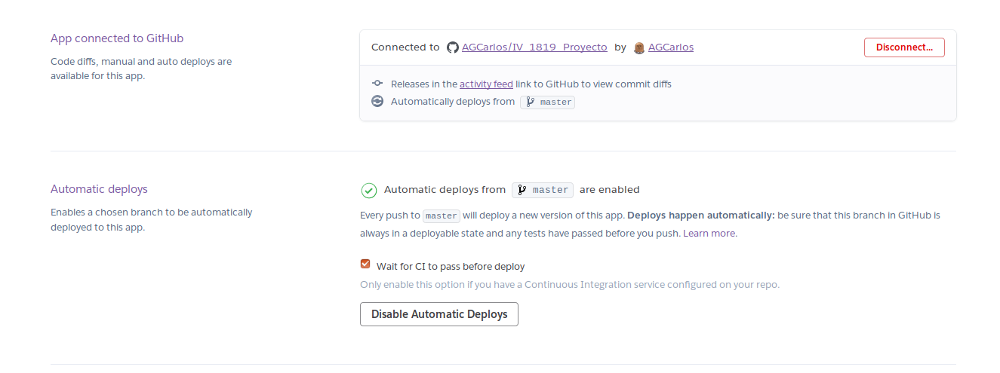

# Documentación del proyecto
---

### Despliegue y ejecución con contenedor
##### Docker
Para configurar nuestro contenedor, seguimos la propia [documentacion](https://docs.docker.com/get-started/#docker-concepts), que nos guía en todo el proceso.
##### Archivos de configuración
- **Dockerfile**: Utilizaremos este archivo para automatizar la creación de una imagen que contiene todo lo necesario para la ejecución de nuestra aplicación.

```
# Use an official Python runtime as a parent image
FROM python:2.7-slim

# Set the working directory to /app
WORKDIR /app

# Copy the current directory contents into the container at /app
COPY . /app

# Instalación de todos los requisitos del entorno
RUN pip install --trusted-host pypi.python.org -r requirements.txt

# Abrir puertos, en este caso abrimos el puerto 80
EXPOSE 80

# Variables en tiempo de ejecución
ARG buildtime_variable=default_value

# Variables de entorno
ENV REDIS_URL=$buildtime_variable
ENV NAME World

# Aplicación que se ejecutará al lanzar el contenedor
CMD ["python", "app.py"]
```
Cómo la aplicación utiliza Redis, para conectarse necesita una variable de entorno, que ha sido especificada en el Dockerfile, pero se asigna en tiempo de ejecución de manera que no se vulnere la clave, podemos verlo en el apartado de variables del Dockerfile. Los mismos comentarios del archivo lo explican.  
Además se añade el archivo .dockerignore para que no se copien los archivos que no sean necesarios a la imagen.
##### Construcción automatizada de la imagen
He configurado Docker para que cada vez que se suben los archivos fuentes a Github se construya de nuevo:  


  

Esperará a que pasen los test del repositorio antes de construir la imagen.

##### Utilizando la aplicación
Se ha creado y desplegado una imagen de la aplicación en DockerHub, en [este repositorio](https://hub.docker.com/r/carlosag/iv_1819_proyecto/).  
Para poder utilizar la imagen desde cualquier máquina Linux, debemos utilizar esta orden para poder arrancar la aplicación, que utilizará la imagen del repositorio anterior:
```
docker run -p 4000:80 carlosag/iv_1819_proyecto:latest
```
Si no encuentra la imagen localmente, la descargará automáticamente.
Evidentemente es necesario tener instalado Docker.  
Una vez está ejecutando la aplicación podemos acceder a ella desde: ``http://0.0.0.0:4000``.  

Para acceder desde otra máquina Macintosh o Windows, como Docker crea una máquina virtual será necesario obtener su IP para poder acceder, con la orden:
``docker-machine ip ``.

#### Despliegue de la imagen
##### Heroku
Para realizar el despliegue he creado otra app en Heroku, llamada _filecnc-docker_. La vinculamos a nuestro repositorio de Github para que obtenga los archivos necesarios para el despliegue.

   

Los pasos para realizar el despliegue los encontramos en su [documentación](https://devcenter.heroku.com/categories/deploying-with-docker), que describiré brevemente:  

1. Creamos en nuestro proyecto el archivo _heroku.yml_, que indica a Heroku donde está el _Dockerfile_ para crear la imagen y la orden para ejecutar la aplicación.  

```
build:
  docker:
    web: Dockerfile
run:
web: gunicorn app:app --log-file=-
```

2. Nos identificamos en el registro de Heroku:

```
heroku container:login
```

3. Le decimos a heroku que la nueva aplicación va a ser un contenedor:

```
heroku stack:set container -a filecnc-docker
```

4. Subimos la imagen a la nueva aplicación de Heroku:

```
heroku container:push web --app filecnc-docker
```

5. Desplegamos la aplicación:

```
heroku container:release web --app filecnc-docker
```
Después de estos pasos, la imagen está construida y desplegada en la aplicación a través del Dockefile. Podemos encontrarla aquí:
- [App Heroku Docker](https://filecnc-docker.herokuapp.com/)

##### Zeit

Para desplegar en Zeit desde Linux, descargamos de la [web oficial](https://zeit.co/download#now-cli) un ejecutable que ejecutaremos en nuestro repositorio, introducimos nuestros credenciales de Zeit y la aplicación se despliega automáticamente.   
Encontramos el status de la aplicación desplegado en el siguiente enlace:

- Despliegue: [App en Zeit](https://iv1819proyecto-vrynkyytrf.now.sh/status)
